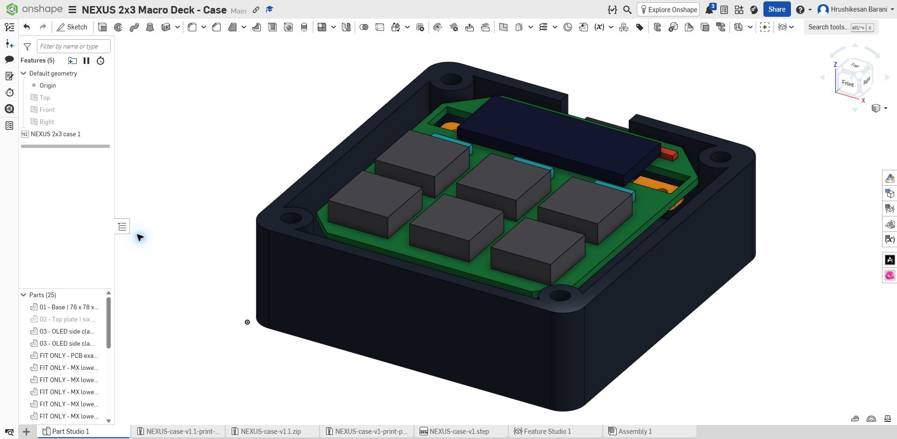

# NEXUS nominal fit check — v1.2

This is a CAD-envelope check, not a release for fabrication or a physical validation. The computer-use workflow added a permanent Onshape fit-preview parameter and regeneration checks; the PDF workflow exposed the incorrect switch stack using the manufacturer's mechanical drawing.

## Corrections

1. PCB top moved from case Z=19.5 to 21 mm. Standard Cherry MX lower housing height is 5 mm from flange/plate top to PCB top, not from plate underside. Plate top Z=26; local 1.5 mm plate underside Z=24.5; PCB bottom Z=19.4.
2. Six diode clearance pockets added beneath the plate, leaving 1.5 mm local plate thickness and pocket ceiling Z=24.5.
3. Vertical OLED header eliminated. J1 retains the same four through-hole pads with a wire-pad footprint and no header model. Use direct-solder flexible leads, with maximum 1.2 mm protrusion above PCB; strain relief is needed.
4. Optional R1/R2 moved to the PCB underside, outside the controller/socket envelope, to avoid overlap with the lid-mounted OLED. They remain DNP by default.

## CAD checks executed

The native case feature generated four printable case bodies plus 21 fit-only bodies: exact PCB outer contour/cutouts, six MX lower-housing envelopes, six diode envelopes, two resistor envelopes, controller component envelope, two socket envelopes, USB-plug envelope, OLED envelope, and wire-pad envelope. It checks all these bodies against the case, plus all fit-body pairs. Interior interference or containment throws a regeneration error. Face contact is allowed. Regeneration succeeded with fit visibility both ON (25 bodies) and OFF (four printable bodies).

The controller/USB-plug envelope pair is deliberately excluded: their bounding boxes overlap at connector engagement. Actual mating shapes, insertion travel, cable bending, solder tails, switches' retaining clips/pins, keycap profiles, and printing/component tolerances are not modeled. Fit-only bodies are not manufacturer STEP models.

## Nominal clearances

| Location | Nominal clearance |
|---|---:|
| Diode envelope to relieved plate ceiling | 1.3 mm |
| Wire-pad envelope to lid underside | 0.8 mm |
| OLED envelope to PCB top | 0.8 mm |
| Clamp to nearest PCB relief boundary | 0.5 mm |
| Controller envelope to floor | 6.1 mm |

These depend on the provisional dimensions and exclude tolerance accumulation. The generic USB envelope is 14 mm wide within a 16 mm case slot; exact Orpheus connector/cable fit remains unverified.

## Electrical verification

After rerouting the underside pullups and replacing J1's footprint: zero reported ERC violations, zero reported DRC violations, zero unconnected items, zero schematic/PCB parity issues. Reports, updated Gerbers and drills are in the KiCad deliverables.

## Still required

- Product links or measured dimensions for the actual controller, sockets, OLED, switches, and USB data cable.
- Confirm insert manufacturer's required pilot diameter, and trial-print one switch cutout and insert hole.
- Replace provisional envelopes with actual component models where available and verify tolerances/lead trimming.
- Write/build/flash firmware and test the physical assembly.
- Download the v1.2 case exports from Onshape; old v1/v1.1 exports are superseded.
- Confirm Keeb accepts a six-key, AI-assisted macro pad before committing grant funds. No organizer has been contacted or application submitted.

Mechanical source: [Cherry MX manufacturer's drawing, page 2](https://www.farnell.com/datasheets/1792245.pdf).

